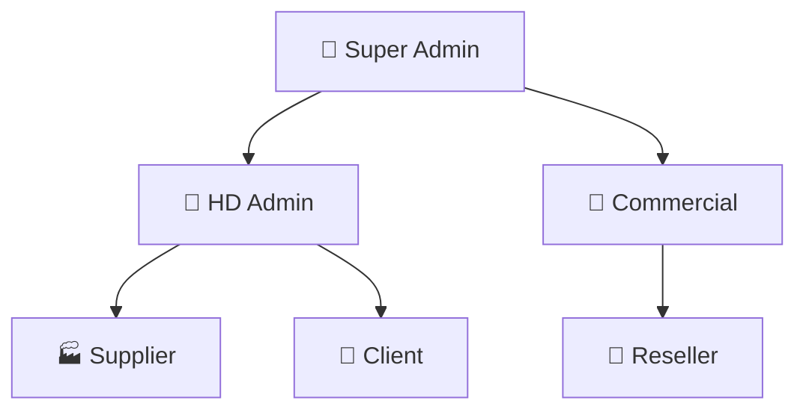

# 📚 SuperMyHD - Developer Documentation

> **The Complete Reference Guide for SuperMyHD Development**
> 
> Last Updated: December 15, 2025 | Version: 3.0

---

## 📖 Table of Contents

1. [Project Overview](#project-overview)
2. [Technology Stack](#technology-stack)
3. [Project Structure](#project-structure)
4. [Global Variables & IDs System](#global-variables--ids-system)
5. [Design System Tokens](#design-system-tokens)
6. [Module Definitions](#module-definitions)
7. [User Roles & Permissions](#user-roles--permissions)
8. [Color Palette Reference](#color-palette-reference)
9. [Component Library](#component-library)
10. [API Endpoints Registry](#api-endpoints-registry)
11. [Database Schema Reference](#database-schema-reference)
12. [Translation Keys](#translation-keys)
13. [Development Guidelines](#development-guidelines)

---

## 🎯 Project Overview

**SuperMyHD** is Havet Digital's unified platform that consolidates all business operations into a single system.

### Vision Statement
> One platform for everything Havet Digital does: Print + Digital + Solutions + Data + Communication + AI-Assisted

### Core Objectives
| ID | Objective | Description |
|----|-----------|-------------|
| `OBJ-001` | One Platform | Everything in one place |
| `OBJ-002` | Unified Services | Print + Digital + Solutions HD |
| `OBJ-003` | Modern Experience | Simple, professional, selling |
| `OBJ-004` | Powerful Internal Tool | Efficient for HD team |
| `OBJ-005` | Replace Old CRM | Progressive migration |
| `OBJ-006` | Centralize Everything | Clients, suppliers, projects |
| `OBJ-007` | Future-Proof | Stable, fast, scalable |
| `OBJ-008` | Data-Driven | All decisions driven by data |

---

## ⚙️ Technology Stack

### Core Technologies
| Technology | Version | Purpose | Documentation |
|------------|---------|---------|---------------|
| Next.js | 16.0.6 | React Framework | [docs](https://nextjs.org/docs) |
| React | 19.2.0 | UI Library | [docs](https://react.dev) |
| Tailwind CSS | 4.x | Styling | [docs](https://tailwindcss.com/docs) |
| Radix UI | Latest | Headless Components | [docs](https://radix-ui.com) |
| Lucide React | 0.555.0 | Icons | [docs](https://lucide.dev) |
| Geist Font | 1.5.1 | Typography | [docs](https://vercel.com/font) |

### Dev Dependencies
| Package | Purpose |
|---------|---------|
| `eslint` | Code linting |
| `tw-animate-css` | Animations |
| `babel-plugin-react-compiler` | Performance optimization |

---

## 📁 Project Structure

```
supermyhd/
├── 📂 src/
│   ├── 📂 app/                    # Next.js App Router
│   │   ├── 📄 layout.js           # Root layout
│   │   ├── 📄 page.js             # Home page
│   │   ├── 📄 globals.css         # Global styles
│   │   ├── 📂 pricing/            # Pricing module
│   │   └── 📂 solutions/          # Solutions module
│   │
│   ├── 📂 components/             # Reusable components
│   │   ├── 📂 ui/                 # Shadcn UI components
│   │   ├── 📄 Navigation.js       # Main navigation
│   │   ├── 📄 MegaMenu.js         # Mega menu component
│   │   ├── 📄 Hero.js             # Hero section
│   │   ├── 📄 Footer.js           # Footer component
│   │   ├── 📄 AppCard.js          # Module app cards
│   │   ├── 📄 SolutionCard.js     # Solution cards
│   │   ├── 📄 PricingCalculator.js # Pricing calculator
│   │   ├── 📄 language-provider.js # i18n provider
│   │   ├── 📄 language-selector.js # Language selector
│   │   ├── 📄 theme-provider.js   # Theme provider
│   │   └── 📄 theme-toggle.js     # Dark/Light toggle
│   │
│   └── 📂 lib/                    # Utilities & configs
│       ├── 📄 designSystem.js     # Design tokens
│       ├── 📄 modules.js          # Module definitions
│       ├── 📄 solutions.js        # Solutions data
│       ├── 📄 translations.js     # Multi-language strings
│       └── 📄 utils.js            # Utility functions
│
├── 📂 public/                     # Static assets
├── 📂 myelements - DONT TOUCH/    # Protected reference files
│   └── 📄 SuperMyHD_Roadmap.md    # Project roadmap
│
├── 📄 DEV_DOCUMENTATION.md        # THIS FILE
├── 📄 FONT_GUIDE.md               # Font usage guide
├── 📄 TRANSLATION_GUIDE.md        # Translation guide
└── 📄 README.md                   # Project readme
```

---

## 🔑 Global Variables & IDs System

### Module IDs
Use these IDs consistently across the codebase:

| Variable Name | ID Value | Description | Route |
|---------------|----------|-------------|-------|
| `MODULE_CLIENT_PORTAL` | `client-portal` | Client-facing dashboard | `/client` |
| `MODULE_INTERNAL_COCKPIT` | `internal-cockpit` | HD Team admin hub | `/admin` |
| `MODULE_SALES_COCKPIT` | `sales-cockpit` | Sales team tools | `/sales` |
| `MODULE_SUPPLIER_PORTAL` | `supplier-portal` | Supplier management | `/supplier` |
| `MODULE_RESELLER_HUB` | `reseller-hub` | Reseller portal | `/reseller` |
| `MODULE_DATA_ANALYTICS` | `data-analytics` | Analytics dashboard | `/data` |

### User Role IDs
| Variable Name | ID Value | Description | Access Level |
|---------------|----------|-------------|--------------|
| `ROLE_SUPER_ADMIN` | `super-admin` | Full platform control | 👑 Full |
| `ROLE_HD_ADMIN` | `hd-admin` | Internal operations | 👤 Admin |
| `ROLE_COMMERCIAL` | `commercial` | Sales tools + clients | 💼 Sales |
| `ROLE_SUPPLIER` | `supplier` | Supplier portal only | 🏭 Limited |
| `ROLE_CLIENT` | `client` | Client portal only | 🛒 Limited |
| `ROLE_RESELLER` | `reseller` | Reseller portal only | 🤝 Limited |

### Feature Flags
| Variable Name | Default | Description |
|---------------|---------|-------------|
| `FEATURE_AI_ASSISTANT` | `false` | AI-powered assistant |
| `FEATURE_DARK_MODE` | `true` | Dark/Light theme toggle |
| `FEATURE_MULTI_LANG` | `true` | Multi-language support |
| `FEATURE_REAL_TIME` | `false` | Real-time notifications |
| `FEATURE_CHAT` | `false` | In-app chat system |

### Milestone IDs
| ID | Name | Priority | Features Count |
|----|------|----------|----------------|
| `M1` | Core Platform Setup | 🔴 High | 7 |
| `M2` | Authentication & Users | 🔴 High | 7 |
| `M3` | Print Production System | 🔴 High | 9 |
| `M4` | Client Catalog System | 🔴 High | 7 |
| `M5` | Quote & Order Management | 🔴 High | 11 |
| `M6` | Client Portal | 🔴 High | 14 |
| `M7` | Supplier Portal | 🟡 Medium | 8 |
| `M8` | HD Team Cockpit | 🔴 High | 12 |
| `M9` | Sales Cockpit | 🟡 Medium | 9 |
| `M10` | Reseller Portal | 🟢 Lower | 6 |
| `M11` | Smart Publications | 🔴 High | 8 |
| `M12` | Data & Analytics | 🟡 Medium | 8 |
| `M13` | Digital Services | 🟡 Medium | 9 |
| `M14` | Automation & Integration | 🟡 Medium | 6 |
| `M15` | Unified Communication | 🟡 Medium | 6 |

---

## 🎨 Design System Tokens

### Typography
Located in: `src/lib/designSystem.js`

```javascript
fonts: {
    display: "var(--font-geist-sans)",  // Headings (h1-h6)
    body: "var(--font-geist-sans)",     // Body text
    mono: "var(--font-geist-mono)",     // Code blocks
}

fontWeights: {
    light: "300",
    normal: "400",
    medium: "500",
    semibold: "600",
    bold: "700",
    extrabold: "800",
}
```

### Spacing Scale
| Token | Value | Pixels |
|-------|-------|--------|
| `xs` | 0.5rem | 8px |
| `sm` | 0.75rem | 12px |
| `md` | 1rem | 16px |
| `lg` | 1.5rem | 24px |
| `xl` | 2rem | 32px |
| `2xl` | 3rem | 48px |
| `3xl` | 4rem | 64px |

### Border Radius
| Token | Value | Pixels |
|-------|-------|--------|
| `none` | 0 | 0px |
| `sm` | 0.375rem | 6px |
| `md` | 0.5rem | 8px |
| `lg` | 0.75rem | 12px |
| `xl` | 1rem | 16px |
| `2xl` | 1.5rem | 24px |
| `full` | 9999px | Circular |

### Shadows
| Token | Value |
|-------|-------|
| `sm` | `0 1px 2px 0 rgb(0 0 0 / 0.05)` |
| `md` | `0 4px 6px -1px rgb(0 0 0 / 0.1)` |
| `lg` | `0 10px 15px -3px rgb(0 0 0 / 0.1)` |
| `xl` | `0 20px 25px -5px rgb(0 0 0 / 0.1)` |
| `2xl` | `0 25px 50px -12px rgb(0 0 0 / 0.25)` |

### Transitions
| Token | Duration | Easing |
|-------|----------|--------|
| `fast` | 150ms | cubic-bezier(0.4, 0, 0.2, 1) |
| `base` | 300ms | cubic-bezier(0.4, 0, 0.2, 1) |
| `slow` | 500ms | cubic-bezier(0.4, 0, 0.2, 1) |

### Breakpoints
| Token | Value | Description |
|-------|-------|-------------|
| `sm` | 640px | Small devices |
| `md` | 768px | Medium devices |
| `lg` | 1024px | Large devices |
| `xl` | 1280px | Extra large |
| `2xl` | 1536px | 2XL screens |

---

## 🎨 Color Palette Reference

### Primary Brand Colors
| Shade | Hex Code | Usage |
|-------|----------|-------|
| 50 | `#F5F3FF` | Background tints |
| 100 | `#EDE9FE` | Light backgrounds |
| 200 | `#DDD6FE` | Borders, dividers |
| 300 | `#C4B5FD` | Secondary elements |
| 400 | `#A78BFA` | Hover states |
| **500** | **`#8B5CF6`** | **Main brand color** |
| 600 | `#7C3AED` | Active states |
| 700 | `#6D28D9` | Deep accents |
| 800 | `#5B21B6` | Headers |
| 900 | `#4C1D95` | Dark backgrounds |

### Module Colors
| Module | Color | Hex Code | Tailwind |
|--------|-------|----------|----------|
| Client Portal | Blue | `#0066CC` | `blue-600` |
| Internal Cockpit | Purple | `#8B5CF6` | `purple-500` |
| Sales Cockpit | Green | `#10B981` | `green-500` |
| Supplier Portal | Orange | `#F59E0B` | `orange-500` |
| Reseller Hub | Red | `#EF4444` | `red-500` |
| Data Analytics | Teal | `#14B8A6` | `teal-500` |

---

## 📦 Module Definitions

Located in: `src/lib/modules.js`

### Client Portal
| Property | Value |
|----------|-------|
| ID | `client-portal` |
| Route | `/client` |
| Icon | `Users` |
| Color | Blue |
| Features | Dashboard, Order tracking, File management, AI assistant, Payment |

### Internal Cockpit
| Property | Value |
|----------|-------|
| ID | `internal-cockpit` |
| Route | `/admin` |
| Icon | `LayoutDashboard` |
| Color | Purple |
| Features | Client management, Project tracking, Team collaboration, Documents, Automation |

### Sales Cockpit
| Property | Value |
|----------|-------|
| ID | `sales-cockpit` |
| Route | `/sales` |
| Icon | `TrendingUp` |
| Color | Green |
| Features | Sales pipeline, Lead scoring, Quote generator, AI assistant, Follow-ups |

### Supplier Portal
| Property | Value |
|----------|-------|
| ID | `supplier-portal` |
| Route | `/supplier` |
| Icon | `Package` |
| Color | Orange |
| Features | Request management, Offer submission, Order tracking, Performance, Documents |

### Reseller Hub
| Property | Value |
|----------|-------|
| ID | `reseller-hub` |
| Route | `/reseller` |
| Icon | `Store` |
| Color | Red |
| Features | White label, Commission tracking, Marketing tools, Regional support, Custom catalog |

### Data Analytics
| Property | Value |
|----------|-------|
| ID | `data-analytics` |
| Route | `/data` |
| Icon | `BarChart3` |
| Color | Teal |
| Features | Global dashboard, Custom reports, AI predictions, Trend analysis, Forecasting |

---

## 👥 User Roles & Permissions

### Role Hierarchy


### Permissions Matrix
| Permission | Super Admin | HD Admin | Commercial | Supplier | Client | Reseller |
|------------|:-----------:|:--------:|:----------:|:--------:|:------:|:--------:|
| Full Control | ✅ | ❌ | ❌ | ❌ | ❌ | ❌ |
| User Management | ✅ | ✅ | ❌ | ❌ | ❌ | ❌ |
| View All Data | ✅ | ✅ | ❌ | ❌ | ❌ | ❌ |
| Sales Tools | ✅ | ❌ | ✅ | ❌ | ❌ | ❌ |
| Client Portal | ✅ | ✅ | ✅ | ❌ | ✅ | ❌ |
| Supplier Portal | ✅ | ✅ | ❌ | ✅ | ❌ | ❌ |
| Reseller Portal | ✅ | ❌ | ❌ | ❌ | ❌ | ✅ |
| Data Analytics | ✅ | ✅ | ✅ | ❌ | ❌ | ✅ |

### Module Access by Role
| Role | Accessible Modules |
|------|-------------------|
| Super Admin | All modules |
| HD Admin | Internal Cockpit, Data Analytics |
| Commercial | Sales Cockpit, Client Portal, Data Analytics |
| Supplier | Supplier Portal only |
| Client | Client Portal only |
| Reseller | Reseller Hub, Data Analytics |

---

## 🧩 Component Library

### UI Components (Shadcn)
Located in: `src/components/ui/`

| Component | File | Description |
|-----------|------|-------------|
| Accordion | `accordion.jsx` | Collapsible content sections |
| Avatar | `avatar.jsx` | User profile images |
| Button | `button.jsx` | Action buttons |
| Card | `card.jsx` | Content containers |
| Checkbox | `checkbox.jsx` | Selection inputs |
| Dialog | `dialog.jsx` | Modal dialogs |
| Dropdown Menu | `dropdown-menu.jsx` | Context menus |
| Navigation Menu | `navigation-menu.jsx` | Nav components |
| Separator | `separator.jsx` | Visual dividers |
| Tooltip | `tooltip.jsx` | Hover information |

### Custom Components
| Component | File | Purpose |
|-----------|------|---------|
| Navigation | `Navigation.js` | Main site navigation with mega menu |
| MegaMenu | `MegaMenu.js` | Dropdown mega menu |
| Hero | `Hero.js` | Landing page hero section |
| Footer | `Footer.js` | Site footer |
| AppCard | `AppCard.js` | Module app cards display |
| SolutionCard | `SolutionCard.js` | Solution showcase cards |
| PricingCalculator | `PricingCalculator.js` | Interactive pricing calculator |
| LanguageProvider | `language-provider.js` | i18n context provider |
| LanguageSelector | `language-selector.js` | Language dropdown |
| ThemeProvider | `theme-provider.js` | Dark/Light mode provider |
| ThemeToggle | `theme-toggle.js` | Theme switch button |

---

## 🔌 API Endpoints Registry

> **Note:** Endpoints to be implemented as the project progresses.

### Authentication API
| Method | Endpoint | Description | Status |
|--------|----------|-------------|--------|
| POST | `/api/auth/login` | User login | ⏳ Planned |
| POST | `/api/auth/logout` | User logout | ⏳ Planned |
| POST | `/api/auth/register` | User registration | ⏳ Planned |
| POST | `/api/auth/reset-password` | Password reset | ⏳ Planned |
| POST | `/api/auth/verify-email` | Email verification | ⏳ Planned |

### User API
| Method | Endpoint | Description | Status |
|--------|----------|-------------|--------|
| GET | `/api/users` | List all users | ⏳ Planned |
| GET | `/api/users/:id` | Get user by ID | ⏳ Planned |
| PUT | `/api/users/:id` | Update user | ⏳ Planned |
| DELETE | `/api/users/:id` | Delete user | ⏳ Planned |

### Orders API
| Method | Endpoint | Description | Status |
|--------|----------|-------------|--------|
| GET | `/api/orders` | List all orders | ⏳ Planned |
| POST | `/api/orders` | Create new order | ⏳ Planned |
| GET | `/api/orders/:id` | Get order by ID | ⏳ Planned |
| PUT | `/api/orders/:id` | Update order | ⏳ Planned |

---

## 🗄️ Database Schema Reference

> **Note:** Schema to be implemented with Firebase/Supabase.

### Users Collection
```javascript
{
  id: "USER_ID",
  email: "string",
  displayName: "string",
  role: "ROLE_ID",
  photoURL: "string",
  phone: "string",
  createdAt: "timestamp",
  updatedAt: "timestamp",
  preferences: {
    theme: "light" | "dark",
    language: "fr" | "en" | "ar",
    notifications: boolean
  }
}
```

### Orders Collection
```javascript
{
  id: "ORDER_ID",
  clientId: "USER_ID",
  status: "pending" | "confirmed" | "production" | "shipping" | "delivered",
  items: [{
    productId: "PRODUCT_ID",
    quantity: number,
    unitPrice: number
  }],
  total: number,
  createdAt: "timestamp",
  updatedAt: "timestamp"
}
```

---

## 🌍 Translation Keys

Located in: `src/lib/translations.js`

### Supported Languages
| Code | Language | Direction |
|------|----------|-----------|
| `fr` | Français | LTR |
| `en` | English | LTR |
| `ar` | العربية | RTL |

### Key Naming Convention
```
category.subcategory.key

Examples:
- nav.home
- nav.solutions
- hero.title
- hero.subtitle
- footer.copyright
- common.loadMore
- actions.submit
- errors.required
```

### Usage in Components
```javascript
import { useLanguage } from '@/components/language-provider';

function MyComponent() {
  const { t, lang } = useLanguage();
  
  return <h1>{t('hero.title')}</h1>;
}
```

---

## 📋 Development Guidelines

### File Naming Conventions
| Type | Convention | Example |
|------|------------|---------|
| Components | PascalCase | `AppCard.js` |
| Utilities | camelCase | `designSystem.js` |
| Pages | lowercase | `page.js` |
| CSS | lowercase | `globals.css` |

### Import Order
```javascript
// 1. React/Next.js imports
import { useState, useEffect } from 'react';
import Link from 'next/link';

// 2. Third-party libraries
import { motion } from 'framer-motion';

// 3. UI components
import { Button } from '@/components/ui/button';

// 4. Custom components
import { Navigation } from '@/components/Navigation';

// 5. Utilities and configs
import { designSystem } from '@/lib/designSystem';
import { cn } from '@/lib/utils';
```

### Component Structure
```javascript
/**
 * ComponentName - Brief description
 * 
 * @param {Object} props - Component props
 * @returns {JSX.Element} - Rendered component
 */
export function ComponentName({ prop1, prop2 }) {
  // 1. State declarations
  const [state, setState] = useState();
  
  // 2. Effects
  useEffect(() => {}, []);
  
  // 3. Event handlers
  const handleClick = () => {};
  
  // 4. Render
  return (
    <div className="">
      {/* Content */}
    </div>
  );
}
```

### Git Commit Messages
```
<type>(<scope>): <subject>

Types:
- feat: New feature
- fix: Bug fix
- docs: Documentation
- style: Formatting
- refactor: Code restructuring
- test: Adding tests
- chore: Maintenance

Examples:
- feat(auth): add login page
- fix(nav): resolve dropdown positioning
- docs(readme): update installation steps
```

---

## 🔧 Useful Commands

### Development
```bash
# Start dev server
npm run dev

# Build for production
npm run build

# Start production server
npm run start

# Run linter
npm run lint
```

### Git Workflow
```bash
# Create feature branch
git checkout -b feature/feature-name

# Commit changes
git add .
git commit -m "feat(scope): message"

# Push to remote
git push origin feature/feature-name
```

---

## 📞 Quick Reference

### Helper Functions
From `src/lib/designSystem.js`:

| Function | Description | Example |
|----------|-------------|---------|
| `getFont(type)` | Get font family | `getFont('display')` |
| `getColor(path)` | Get color value | `getColor('primary.500')` |
| `getSpacing(size)` | Get spacing value | `getSpacing('lg')` |
| `getRadius(size)` | Get border radius | `getRadius('md')` |

From `src/lib/modules.js`:

| Function | Description | Example |
|----------|-------------|---------|
| `getModuleById(id)` | Get module by ID | `getModuleById('client-portal')` |
| `getModulesByRole(role)` | Get modules for role | `getModulesByRole('admin')` |

---

## 🆘 Getting Help

1. **Check this documentation first**
2. **Review the roadmap:** `myelements - DONT TOUCH/SuperMyHD_Roadmap.md`
3. **Check translation guide:** `TRANSLATION_GUIDE.md`
4. **Check font guide:** `FONT_GUIDE.md`

---

> **🤖 AI Note:** This documentation is designed for AI assistants and developers to quickly understand the project structure, conventions, and current state. Always reference this file when working on SuperMyHD.
